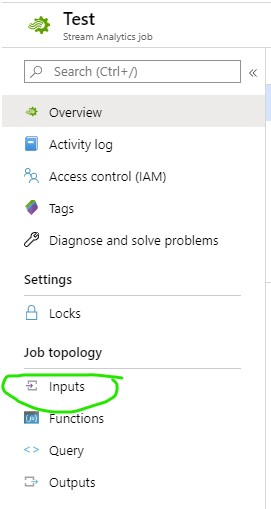
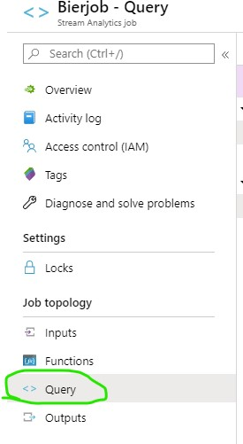
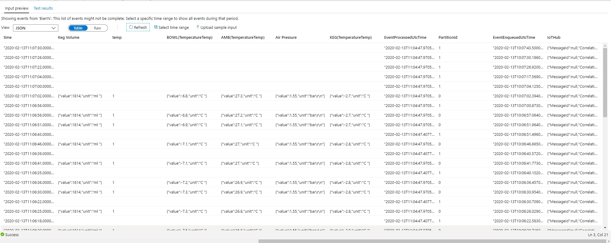
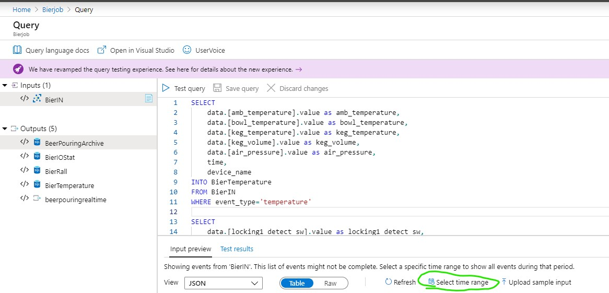
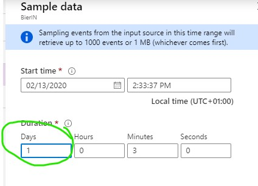
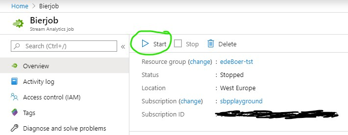
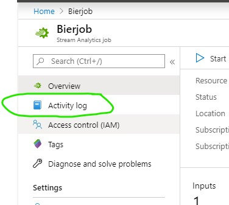
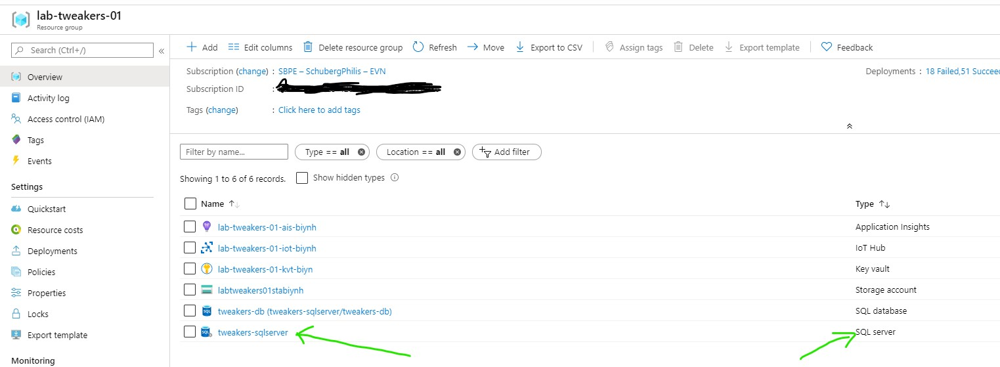

# Step 3: Create an Azure Stream Analytics Job
We use the Azure Stream Analytics Job to read the messages that the Beer Taps send from the IoT-Hub and route them to a SQL Database. Why a Stream Analytics Job, IoT-Hub Messages have to be parsed before you can read the contents of it. This can be done with an Azure Function for example, but we chose to use a Stream Analytics Job as it is a bit easier for you guys as not everybody has a developer background.

Within the Stream Analytics Job we create Queries that get IoT-Hub messages, extract the JSON attribute values and insert the in a SQL database.

Belowe steps use the Azure Portal UI to create the job. Off course this can also be done with an ARM template or the Azure CLI.

## Creating the Stream Analytics Job
1. Click on "_Create a Resource_" and search for "_Stream Analytics job_", once you found it click on **Create**
2. Fill in the following details:
   * **Job Name**: Come up with an original name that you can easily find back.
   * **Subscription**: You should have only 1 choice here "SBPE – SchubergPhilis – EVN"
   * **Resource Group**: Your ResourceGroup (same number as the number in your username)
   * **Location**: West Europe
   * **Hosting Environment**: Cloud (you would select edge if the job would run on an IoT-Edge device)
   * **Streamin Units**: put the slider to **1**! --> _This saves us $$$ and makes sure we can do these kind of workshops more often for you guys. 1 unit has more than enough power for this workshop_ 
3. Click on **Validate/Create**
4. Wait for the deployment to finish. This should be finished in +- 1 minute.

## Configuring the Stream Analytics Job INPUT
There is only one input neccesary and that is our IoT-Hub, so let's configure it.
1. Once the job is created go to the deployed resource in the Azure Portal.
2. We need to define an Input for this job. Click on **Inputs**

3. Click on **Add Stream Input** and select **IoT Hub**
4. Give the new Input a nice Alias (_BeerIN_ for example). Now only change the IOT HUB to match the one that belongs to the table you are sitting at and Change the _Consumer group_ to the one you created earlier when you configured the IoT-Hub. Leave the other fields at their default values.
5. Click __Save__

Beer Metrics should now be able to flow in.

## Configuring the Stream Analytics Job OUTPUTS
For the Output's we need more than 1, we will create 3 outputs (a fourth will be created later) one for each table that we will create in the SQL Database.

**First Output IOStat data**

1. On the Stream Analytics Job's page click on **Outputs**

2. Click on **Add** and select *SQL Database*
3. Fill in the Folowing Details (If it is not mentioned below, use the default value):
      * **Outpus Alias**: A nice Alias for this Output, I would suggest to make the type of data part of the aliase. (_BeerIOstat_ for example) 
      * **Subscription**: You should have only 1 choice here "SBPE – SchubergPhilis – EVN"
      * **Database**: The database that you created earlier.
      * **Username**: The username you filled in when you created the SQL Database
      * **Password**: Whatever password that belongs to this user.
      * **Table**: Fill in _BeerIOStat_ 
4. Click __Save__

**Second Output Rall data**

1. On the Stream Analytics Job's page click on **Outputs**
2. Click on **Add** and select *SQL Database*
3. Fill in the Folowing Details (If it is not mentioned below, use the default value):
      * **Outpus Alias**: A nice Alias for this Output, I would suggest to make the type of data part of the aliase. (_BeerIOstat_ for example) 
      * **Subscription**: You should have only 1 choice here "SBPE – SchubergPhilis – EVN"
      * **Database**: The database that you created earlier.
      * **Username**: The username you filled in when you created the SQL Database
      * **Password**: Whatever password that belongs to this user.
      * **Table**: Fill in _BeerRall_ 
4. Click __Save__

**Third Output Temperature data**

1. On the Stream Analytics Job's page click on **Outputs**
2. Click on **Add** and select *SQL Database*
3. Fill in the Folowing Details (If it is not mentioned below, use the default value):
      * **Outpus Alias**: A nice Alias for this Output, I would suggest to make the type of data part of the aliase. (_BeerIOstat_ for example) 
      * **Subscription**: You should have only 1 choice here "SBPE – SchubergPhilis – EVN"
      * **Database**: The database that you created earlier.
      * **Username**: The username you filled in when you created the SQL Database
      * **Password**: Whatever password that belongs to this user.
      * **Table**: Fill in _BeerTemperature_ 
4. Click __Save__

You now should see something like this:

## Configuring the Stream Analytics Job Query
The magic of the Stream Analytics job happens in the Query. The query will read the data from the IoT-Hub (Input), Transform it a little bit and send it to the SQL Database Tables (Outputs).

### Adding the query
On the page of the Azure Stream Analytics Job click on Query (you could also click on _edit query_ on the tiny editor on the overview page). 

If you Followed our name suggestions from the above you can copy the query (stream_analytics_query_part1.sql) from the subfolder _stream_analytics_ and paste it in the query screen.
If you __did not__ follow your naming suggestions then please replace the following values in the query with the names __you picked__.
* BeerIN
* BeerIOStat
* BeerRall
* BeerTemperature

Once you replaced these values you can click on __Save query__.

### Testing the query
You should see something like this in the Input preview pane at the lower part of the screen.

If you don't see any values in the input preview then you first need to run a sample on the _BeerIn_ Input.
To do this follow these steps (remember if you have preview data you can skip this!):
1. Click on __Select time range__

2. Change the Days under the heading "Duration" to 1. This will make it sample data from the last 24 hours.

3. Click on __Sample__ (bottom of the page)

Sampling can take a couple of minutes you can see if it finished in the notifications section of the azure portal (The tiny alarmbel on the top right).

If you do see data, then you can select/highlight one of the queries fro the query editor and click on __Test selected query__ to see if the query will give you any results. Please keep in mind that this test is run on the sampled data! __It is not a realtime query on the IoT-Hub!!!__

### Starting the job
Now that we have configured our IN and OUTputs, we can try starting the job.

Click on __Start__. Actually starting the job might take up to a minute or so.

Our job failed to start WTF?!

If you get an error you can find the reaon in the Activity Log.

Aah the firewall on the sql server is blocking the Stream Analytics job:

Let us fix this, go back to the SQL Server you created earlier (The SQL Server, not the SQL DB ;) )
You shouls be able to find the SQL Server in your resource Group:

When you are in the Overview screen of your SQL Server, go to the __Firewalls and virtual networks__ setting under the __security__ section.

You can now do either do one of these things.
1. Add all the available Azure Stream Analytics IP Addresses
2. OR turn on the __Allow Azure services and resources to access this server

For the sake of the workshop, I suggest going for option 2. In real life you might want to be a bit more restrictive in this from a security point of view.

So enable the feature and click on __Save__.

Now let's try to start the job again! It should start now...(if it doesn't please ask for help)

Congratulations Data from the sensors should come through to SQL Server now.

### Why we chose SQL Server as Output
As we are going to use Grafana to visualize the data, the more obvious choise would be an InfluxDB or something like that. However Azure Stream Analytics does not support InfluxDB as an output.
If we would want to go for InfluxDB, we would need something like Azure Databricks or an container running some code between the IoT-Hub and the InfluxDB. Where Databricks is way more expensive just for this workshop. We could also choose for Cosmos DB, which also supports timeseries. However Grafana doesn't support it. Besides that I have more experience with SQL.