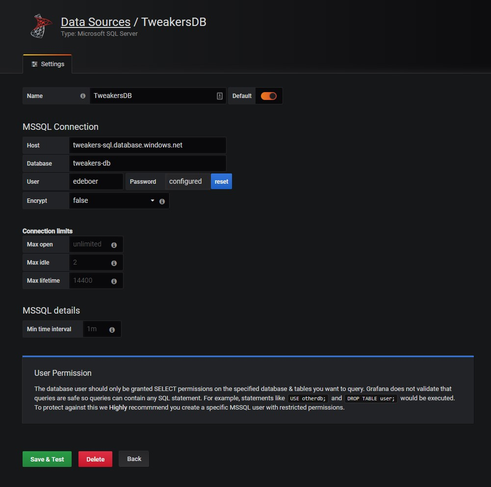
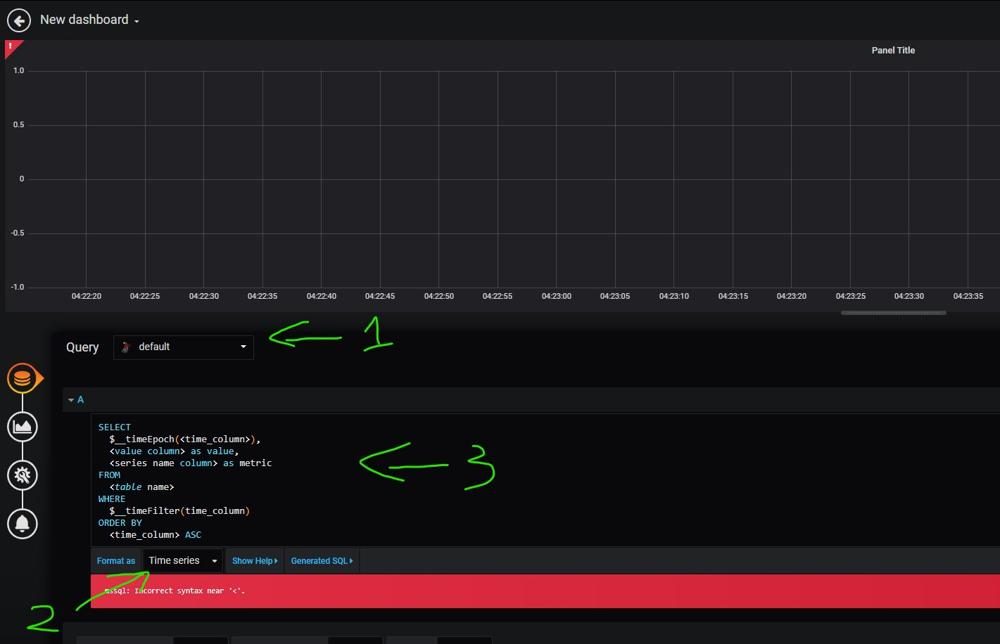
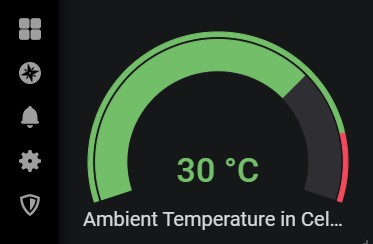
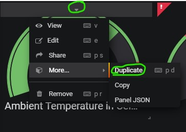

# Step 4: Create a Dashboard in Grafana
For this part of the workshop we will use Grafana to create a nice dashboard of the data that has been stored in the Sql database. Grafana is an open source dashboarding tool. 

## Finding your credentials
For each workshop attendee there is a grafana instance pre-deployed. You can reach it on https://twkrs-XXX-graf.azurewebsites.net where XXX should be replaced with the number that was assigned to you (and your resource group).

Keep in mind that your grafana instance has to wake up when you go to it's URL for the first time. So please be a little patient.

You should see a login screen now. You can find the credentials for your instance on the details card that belongs to your seat. (If you can't find it, contact one of the helpers they can look it up in our Azure Keyvault)

## Allow Grafana to Access your database server
Normally we should only grant IP addresses we know access to the SQL Server. However since we have enabled the *Allow Azure services and resources to access this server* option in an earlier step this will be sufficient for the purpose of the workshop.

## Create your first data Source
In order to Actually show data, we need to specify a Data source.

1. Click on **Add data Source**

2. Select **Microsoft SQL Server** as a source
3. Fill the following details:
    * **Name**: Come up with a recognisable name (*TweakersDB* for example)
    * **Host**: The name of the sql server you deployed (e.g. *tweakers-sql-xxx* where xxx is your resource group nr.)
    * **Database**: The name of the Database you deployed (e.g. *tweakers-db*)
    * **User**: The username you also used for logging into the query explorer (I know that this is not a security best practice ;) )
    * **Password**: The password that matches this user obviously..
    * **Other Settingss**: Leave them to their default values.
4. Click on **Save & Test**
5. Pray that the test is succesfull

## Create your first Dashboard
OK, so now that we have our datasource, we can start creating a dashboard.
Click on the little Grafana Logo on the top lefthand part of the screen to go back to Grafana's Homepage.

1. Click on **New Dashboard**, you will then be presented with an empty dashboard.
2. Let's add a Visualization to the default panel. Click on **Add Query**. The query will supply the data for our Visualization. We will start with the Ambient Temperature sensor of the Beer taps.
3. You should now see something like this:

    

    * In the query Dropdownbox (marked as 1.), select the datasource that you created.
    * In the **Format as** columne (marked as 2.), select **Table**
    * Now in the Query field(marked as 3.) copy the first query from: _grafana_amb_temp_query.sql_
     Be aware that you don't have to copy the comments fro that file (top 6 lines).
4. Now click on the **Visualization** Button

5. Let's create a nice **Gauge**, click on the Gauge icon (marked as 1.). 
6. Set the Display settings (marked as 2.):
    * **Show**: Calculation
    * **Calc**: Last
    * **Labels**: Turned Off
    * **Markers**: Turned On
7. Set the Field settings (marked as 3.):
    * **Title**: A descriptive Title for this Visualization (Suggestion: Ambient Temperature in Celcius)
    * **Unit**: Temperature -> Celcius
    * **Min**: -20 (This represents the lowest value, makes it look nice)
    * **Max**:  50 (This represents the  value, makes it look nice)
    * **Decimals**: auto
8. Set the Treshold Settings (marked as 4.):
    * I added a treshold of 40, this can be whatever you like. I thought an ambient temp of 40 degrees would be considered hot (e.g. I want it to be red and not green) feel free to add whatever tresholds you like.

9. Now click on the **Save icon**, also set the refresh interval to 5 seconds to make your dashboard refresh in near realtime.

10. You should now see data on the gauge. If you don't see any values, double check if your Stream Analytics job is running without errors.

## Adding the other visualizations
If you want to create more gauges, it is easiest to just clone the first gauge we created earlier, modify the query and maybe some other properties.

To clone a gauge perform the following actions:
1. click on the gauge, a small bar with an arrow should appear.
2. Click the arrow, go to **more** and click on **Duplicate**
3. A new clone of your first gauge should now pop up next to the original gauge. 
4. To modify the new gauge click on the same small arrow as in step 1/2 and select **Edit**

5. Modify the query and if needed settings to your liking. Queries can be found in the SQL directory and are prefixed with "*grafana_*".

## Adding a Graph for Keg volume over time